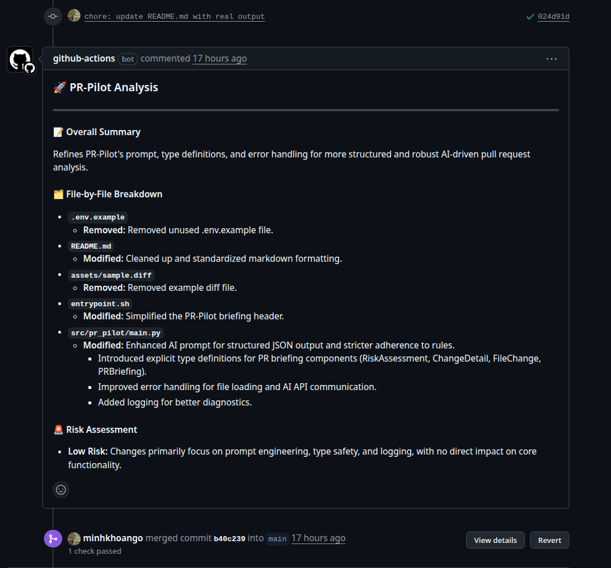

# PR-Pilot  
*An AI-powered briefing officer for your pull requests. Get context, not critique.*

---

## The Problem: The Great War of the PR  
Pull request reviews are the backbone of quality software — but they often turn into bottlenecks.  
Reviewers face immense cognitive load: scanning dozens of files, hundreds of lines, and sparse descriptions while trying to reconstruct the *why* behind a change.  

---

## The Solution: Your Reviewer's Command Center  
PR-Pilot is your automated **briefing officer**, delivering a **single, structured, high-signal briefing** that instantly equips reviewers with context.  

By analyzing the git diff, PR-Pilot provides objective, factual summaries — so human reviewers can focus on what really matters.
 

### What PR-Pilot **Does**:
- **Summarizes Intent:** Explains the high-level purpose of the pull request.  
- **Breaks Down Changes:** Provides a file-by-file walkthrough in plain English.  
- **Assesses Potential Risk:** Flags areas with hidden side effects or touching critical code paths.  

---